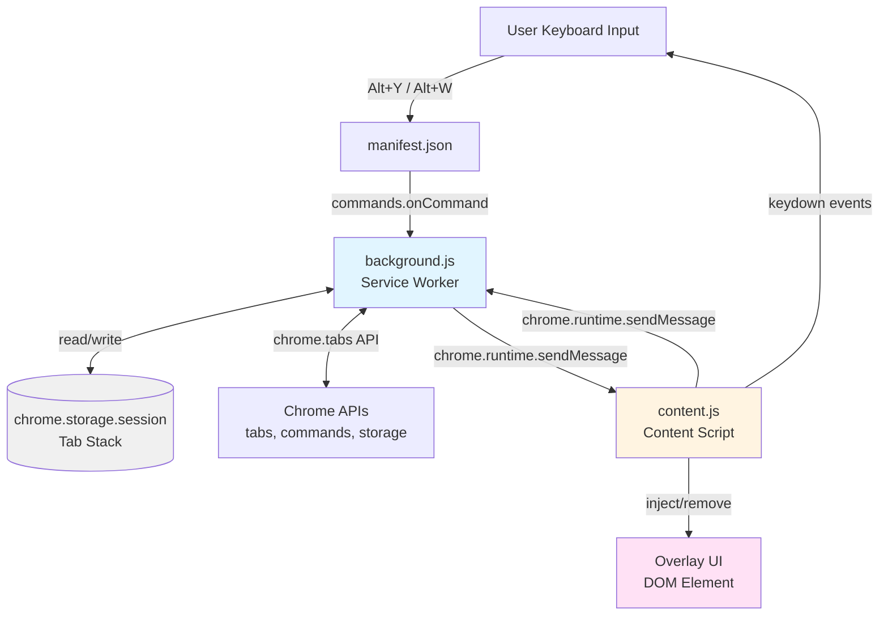
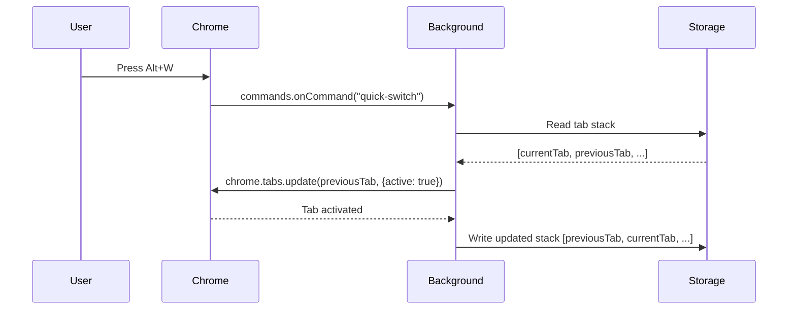
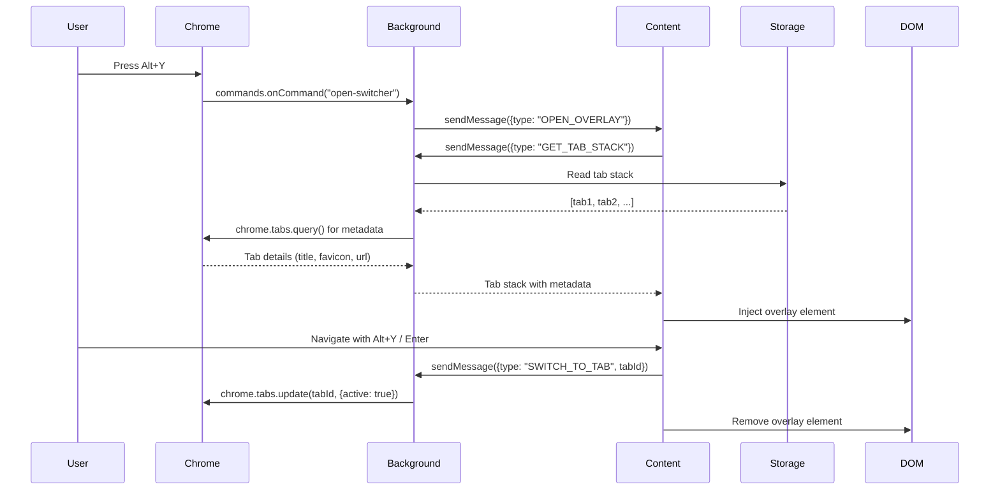

# Design Document: Chrome Tab Switcher Extension

## Overview

The Chrome Tab Switcher is a Manifest V3 browser extension that provides Windows Alt+Tab-style navigation between Chrome tabs. The extension consists of three primary components:

1. **Background Service Worker** (`background.js`) - Manages tab recency state and coordinates tab switching
2. **Content Script** (`content.js`) - Handles overlay UI injection and keyboard event processing
3. **Extension Manifest** (`manifest.json`) - Declares permissions, commands, and component registration

The extension maintains a Most Recently Used (MRU) stack of tab identifiers, persisted across service worker restarts using `chrome.storage.session`. Users can either quick-switch to the previous tab or open a visual overlay to select from recently used tabs.

### Key Design Principles

- **Event-Driven Architecture**: Service worker activates on-demand for tab events and commands
- **Stateless Content Scripts**: UI state derived from background service worker on each display
- **Session Persistence**: Tab stack survives service worker termination but not browser restart
- **Minimal Dependencies**: Vanilla JavaScript with no external libraries
- **CSP Compliance**: No inline scripts, eval(), or external resource loading

## Architecture

### Component Diagram



### Component Interactions

#### Quick Switch Flow


#### Overlay Switch Flow


## Components and Interfaces

### 1. Extension Manifest (manifest.json)

**Purpose**: Declares extension metadata, permissions, and component registration.

**Structure**:
```json
{
  "manifest_version": 3,
  "name": "Chrome Tab Switcher",
  "version": "1.0.0",
  "description": "Alt+Tab style navigation for Chrome tabs",
  
  "permissions": [
    "tabs",
    "storage",
    "activeTab"
  ],
  
  "background": {
    "service_worker": "background.js"
  },
  
  "content_scripts": [
    {
      "matches": ["<all_urls>"],
      "js": ["content.js"],
      "run_at": "document_end",
      "all_frames": false
    }
  ],
  
  "commands": {
    "open-switcher": {
      "suggested_key": {
        "default": "Alt+Y"
      },
      "description": "Open tab switcher overlay"
    },
    "quick-switch": {
      "suggested_key": {
        "default": "Alt+W"
      },
      "description": "Quick switch to previous tab"
    }
  },
  
  "icons": {
    "16": "icons/icon16.png",
    "48": "icons/icon48.png",
    "128": "icons/icon128.png"
  }
}
```

**Key Decisions**:
- **Manifest V3**: Required for modern Chrome extensions, uses service workers instead of persistent background pages
- **`<all_urls>` match pattern**: Content script must be available on all pages to display overlay
- **`document_end` timing**: Ensures DOM is ready before content script executes
- **`all_frames: false`**: Only inject into top-level frames to avoid duplicate overlays in iframes
- **Alt+Y and Alt+W shortcuts**: Non-conflicting alternatives since Alt+Tab is reserved by the OS

### 2. Background Service Worker (background.js)

**Purpose**: Maintains tab recency state, handles commands, and coordinates tab switching.

**Responsibilities**:
- Track tab activation events and maintain MRU stack
- Persist tab stack to session storage
- Handle quick-switch and open-switcher commands
- Provide tab metadata to content scripts
- Execute tab switching operations

**State Management**:
```javascript
// In-memory cache (rebuilt on service worker restart)
// Map of windowId -> array of tab IDs (most recent first)
let tabStacksByWindow = new Map(); // Map<number, number[]>

// Session storage key
const STORAGE_KEY = 'tabStacksByWindow';
```

**Key Functions**:

| Function | Purpose | Triggers |
|----------|---------|----------|
| `initializeTabStacks()` | Restore per-window tab stacks from session storage on startup | Service worker activation |
| `updateTabStack(tabId, windowId)` | Add/move tab to front of window's stack, remove duplicates | `chrome.tabs.onActivated` |
| `persistTabStacks()` | Write all window tab stacks to session storage | After stack modifications |
| `handleQuickSwitch()` | Activate second tab in current window's stack | `commands.onCommand("quick-switch")` |
| `handleOpenSwitcher()` | Send OPEN_OVERLAY message to active tab | `commands.onCommand("open-switcher")` |
| `getTabStackWithMetadata(windowId)` | Query Chrome for tab details in specific window and return enriched stack | Message from content script |
| `switchToTab(tabId)` | Activate specified tab | Message from content script |
| `removeClosedTab(tabId, windowId)` | Remove tab from window's stack when closed | `chrome.tabs.onRemoved` |
| `removeClosedWindow(windowId)` | Remove entire window's stack when window closed | `chrome.windows.onRemoved` |

**Message Protocol** (Received):
```typescript
// From content script
type ContentMessage = 
  | { type: "GET_TAB_STACK", windowId: number }
  | { type: "SWITCH_TO_TAB", tabId: number };
```

**Message Protocol** (Sent):
```typescript
// To content script
type BackgroundMessage = 
  | { type: "OPEN_OVERLAY" }
  | { 
      type: "TAB_STACK_RESPONSE", 
      tabs: Array<{
        id: number,
        title: string,
        url: string,
        domain: string,
        favIconUrl: string
      }>
    };
```

**Chrome API Usage**:
- `chrome.tabs.onActivated` - Track tab switches
- `chrome.tabs.onRemoved` - Clean up closed tabs
- `chrome.tabs.query()` - Retrieve tab metadata
- `chrome.tabs.update()` - Activate tabs
- `chrome.windows.onRemoved` - Clean up closed windows
- `chrome.windows.getCurrent()` - Get current window ID
- `chrome.storage.session.get/set()` - Persist tab stacks
- `chrome.commands.onCommand` - Handle keyboard shortcuts
- `chrome.runtime.sendMessage()` - Send messages to content scripts
- `chrome.tabs.sendMessage()` - Send messages to specific tabs

**Stack Management Algorithm**:
```javascript
function updateTabStack(tabId, windowId) {
  // Get or create stack for this window
  let stack = tabStacksByWindow.get(windowId) || [];
  
  // Remove existing occurrence (if any)
  stack = stack.filter(id => id !== tabId);
  
  // Add to front
  stack.unshift(tabId);
  
  // Limit to 20 items
  if (stack.length > 20) {
    stack = stack.slice(0, 20);
  }
  
  // Update map
  tabStacksByWindow.set(windowId, stack);
  
  // Persist asynchronously
  persistTabStacks();
}
```

**Domain Extraction**:
```javascript
function extractDomain(url) {
  try {
    const urlObj = new URL(url);
    return urlObj.hostname;
  } catch {
    return url; // Fallback for chrome:// URLs
  }
}
```

### 3. Content Script (content.js)

**Purpose**: Inject and manage overlay UI, handle keyboard navigation, coordinate with background service.

**Responsibilities**:
- Listen for OPEN_OVERLAY messages from background
- Request tab stack with metadata
- Inject overlay DOM element
- Handle keyboard navigation (Alt+Y, Shift+Alt+Y, Enter, Escape)
- Detect key release to trigger switch
- Send switch requests to background
- Remove overlay from DOM

**State Management**:
```javascript
// Overlay state (module-level variables)
let overlayElement = null;
let tabList = [];
let selectedIndex = 1; // Default to second tab (previous tab)
let isOverlayOpen = false;
let keyHeldDown = false;
```

**Key Functions**:

| Function | Purpose | Triggers |
|----------|---------|----------|
| `handleOpenOverlay()` | Request tab stack and inject overlay | Message from background |
| `requestTabStack()` | Send GET_TAB_STACK message to background with current window ID | After receiving OPEN_OVERLAY |
| `injectOverlay(tabs)` | Create and insert overlay DOM element | Receiving tab stack response |
| `renderTabCards(tabs)` | Generate HTML for tab cards | During overlay injection |
| `handleKeyDown(event)` | Process navigation keys while overlay open | `document.keydown` event |
| `handleKeyUp(event)` | Detect Alt key release to trigger switch | `document.keyup` event |
| `switchToSelectedTab()` | Send SWITCH_TO_TAB message and close overlay | Enter key or Alt release |
| `closeOverlay()` | Remove overlay from DOM and reset state | Escape key or after switch |
| `moveSelection(direction)` | Update selectedIndex with wrapping | Alt+Y navigation |
| `getCurrentWindowId()` | Get current window ID using chrome.windows.getCurrent | Before requesting tab stack |

**Keyboard Event Handling**:
```javascript
function handleKeyDown(event) {
  if (!isOverlayOpen) return;
  
  // Alt+Y: Move to next tab
  if (event.altKey && event.key === 'y' && !event.shiftKey) {
    event.preventDefault();
    moveSelection(1);
    keyHeldDown = true;
  }
  
  // Shift+Alt+Y: Move to previous tab
  if (event.altKey && event.shiftKey && event.key === 'Y') {
    event.preventDefault();
    moveSelection(-1);
    keyHeldDown = true;
  }
  
  // Enter: Switch to selected tab
  if (event.key === 'Enter') {
    event.preventDefault();
    switchToSelectedTab();
  }
  
  // Escape: Close without switching
  if (event.key === 'Escape') {
    event.preventDefault();
    closeOverlay();
  }
}

function handleKeyUp(event) {
  if (!isOverlayOpen) return;
  
  // Alt key released: switch to selected tab
  if (event.key === 'Alt' && keyHeldDown) {
    switchToSelectedTab();
  }
}
```

**Selection Movement with Wrapping**:
```javascript
function moveSelection(direction) {
  selectedIndex = (selectedIndex + direction + tabList.length) % tabList.length;
  updateHighlight();
}
```

**Message Protocol** (Received):
```typescript
// From background
type BackgroundMessage = 
  | { type: "OPEN_OVERLAY" }
  | { 
      type: "TAB_STACK_RESPONSE", 
      tabs: Array<TabMetadata>
    };
```

**Message Protocol** (Sent):
```typescript
// To background
type ContentMessage = 
  | { type: "GET_TAB_STACK", windowId: number }
  | { type: "SWITCH_TO_TAB", tabId: number };
```

### 4. Overlay UI Component

**Purpose**: Visual interface for tab selection.

**DOM Structure**:
```html
<div id="chrome-tab-switcher-overlay">
  <div class="cts-backdrop"></div>
  <div class="cts-container">
    <div class="cts-tab-list">
      <div class="cts-tab-card" data-tab-id="123">
        
        <div class="cts-tab-info">
          <div class="cts-tab-title">Page Title</div>
          <div class="cts-tab-domain">example.com</div>
        </div>
      </div>
      <!-- More tab cards... -->
    </div>
  </div>
</div>
```

**CSS Architecture**:
- All styles scoped to `#chrome-tab-switcher-overlay` to avoid conflicts
- CSS variables for theming and dimensions
- System fonts only (no external font loading)
- Smooth animations for fade-in/fade-out
- High z-index (2147483647) to appear above all page content
- Backdrop blur effect for visual separation

**Styling Constraints**:
```css
#chrome-tab-switcher-overlay {
  /* Isolation */
  all: initial;
  position: fixed;
  z-index: 2147483647;
  
  /* CSS Variables */
  --cts-backdrop-color: rgba(0, 0, 0, 0.5);
  --cts-container-bg: #ffffff;
  --cts-highlight-bg: #e3f2fd;
  --cts-border-radius: 8px;
  --cts-card-height: 64px;
  
  /* Fonts */
  font-family: system-ui, -apple-system, sans-serif;
}
```

**Highlight Behavior**:
- Second tab card highlighted by default (most recent previous tab)
- Highlighted card has distinct background color
- Smooth transition when selection changes
- Visual indicator (border or shadow) for selected card

**Scrolling**:
- Container displays up to 9 tab cards without scrolling
- Vertical scroll enabled when more than 9 tabs
- Selected card automatically scrolled into view

## Data Models

### Tab Stack

**Storage Location**: `chrome.storage.session` with key `"tabStacksByWindow"`

**Structure**:
```typescript
type TabStacksByWindow = Record<number, number[]>; // windowId -> array of tab IDs

// Example:
{
  "1234": [456, 123, 789],  // Window 1234's stack
  "5678": [234, 567, 890]   // Window 5678's stack
}
```

**Constraints**:
- Maximum 20 items per window stack
- No duplicates within a window's stack
- Most recently used tab at index 0 for each window
- Current active tab always at index 0 after activation

**Persistence Behavior**:
- Survives service worker termination
- Cleared on browser restart
- Written within 100ms of modifications
- Read on service worker startup
- Entire map persisted as a single object

### Tab Metadata

**Purpose**: Enriched tab information for overlay display.

**Structure**:
```typescript
interface TabMetadata {
  id: number;           // Chrome tab ID
  title: string;        // Page title (truncated to 40 chars for display)
  url: string;          // Full URL
  domain: string;       // Extracted hostname
  favIconUrl: string;   // Favicon URL (may be empty)
}
```

**Source**: Retrieved via `chrome.tabs.query()` in background service worker.

**Transformation**:
```javascript
async function getTabStackWithMetadata(windowId) {
  const tabs = await chrome.tabs.query({ windowId });
  const tabMap = new Map(tabs.map(t => [t.id, t]));
  
  // Get stack for this window
  const stack = tabStacksByWindow.get(windowId) || [];
  
  // Filter out closed tabs and enrich with metadata
  const enrichedStack = stack
    .filter(id => tabMap.has(id))
    .map(id => {
      const tab = tabMap.get(id);
      return {
        id: tab.id,
        title: tab.title || 'Untitled',
        url: tab.url || '',
        domain: extractDomain(tab.url || ''),
        favIconUrl: tab.favIconUrl || ''
      };
    });
  
  // Update stack to remove closed tabs
  tabStacksByWindow.set(windowId, enrichedStack.map(t => t.id));
  persistTabStacks();
  
  return enrichedStack;
}
```

### Message Types

**Background → Content**:
```typescript
type BackgroundToContentMessage = 
  | { type: "OPEN_OVERLAY" }
  | { 
      type: "TAB_STACK_RESPONSE", 
      tabs: TabMetadata[]
    };
```

**Content → Background**:
```typescript
type ContentToBackgroundMessage = 
  | { type: "GET_TAB_STACK", windowId: number }
  | { 
      type: "SWITCH_TO_TAB", 
      tabId: number 
    };
```

**Message Handling Pattern**:
```javascript
// Background service worker
chrome.runtime.onMessage.addListener((message, sender, sendResponse) => {
  if (message.type === "GET_TAB_STACK") {
    getTabStackWithMetadata(message.windowId).then(tabs => {
      sendResponse({ type: "TAB_STACK_RESPONSE", tabs });
    });
    return true; // Async response
  }
  
  if (message.type === "SWITCH_TO_TAB") {
    switchToTab(message.tabId);
    sendResponse({ success: true });
  }
});

// Content script
chrome.runtime.onMessage.addListener((message, sender, sendResponse) => {
  if (message.type === "OPEN_OVERLAY") {
    handleOpenOverlay();
  }
});
```

## Error Handling

### Service Worker Errors

| Error Scenario | Handling Strategy | User Impact |
|----------------|-------------------|-------------|
| Session storage read fails | Initialize empty tab stacks map | Extension starts with no history |
| Session storage write fails | Log error, continue operation | Tab history not persisted across restarts |
| Tab activation fails (tab closed) | Remove from stack, try next tab | Graceful fallback to next available tab |
| Invalid tab ID in stack | Filter out during metadata retrieval | Stale tabs automatically cleaned up |
| Chrome API permission denied | Fail silently, log to console | Command has no effect |
| Window closed | Remove window's stack from map | Automatic cleanup of closed window data |

**Implementation**:
```javascript
async function initializeTabStacks() {
  try {
    const result = await chrome.storage.session.get(STORAGE_KEY);
    const stored = result[STORAGE_KEY] || {};
    tabStacksByWindow = new Map(Object.entries(stored).map(([k, v]) => [parseInt(k), v]));
  } catch (error) {
    console.error('Failed to restore tab stacks:', error);
    tabStacksByWindow = new Map();
  }
}

async function switchToTab(tabId) {
  try {
    await chrome.tabs.update(tabId, { active: true });
  } catch (error) {
    console.error('Failed to switch to tab:', error);
    // Tab will be removed from stack on next metadata retrieval
  }
}

// Listen for window closure
chrome.windows.onRemoved.addListener((windowId) => {
  tabStacksByWindow.delete(windowId);
  persistTabStacks();
});
```

### Content Script Errors

| Error Scenario | Handling Strategy | User Impact |
|----------------|-------------------|-------------|
| Overlay injection on chrome:// page | Catch and ignore (CSP violation) | Command silently fails on restricted pages |
| Message to background fails | Log error, close overlay | Overlay closes without switching |
| Tab metadata request timeout | Use cached data or close overlay | Overlay may show stale data or close |
| DOM manipulation fails | Catch and log, attempt cleanup | Overlay may not display or may leave artifacts |
| Keyboard event listener fails | Fail silently | Keyboard navigation may not work |

**Implementation**:
```javascript
function injectOverlay(tabs) {
  try {
    // Check if we're on a restricted page
    if (window.location.protocol === 'chrome:') {
      console.warn('Cannot inject overlay on chrome:// pages');
      return;
    }
    
    // Create and inject overlay
    overlayElement = createOverlayElement(tabs);
    document.body.appendChild(overlayElement);
    isOverlayOpen = true;
  } catch (error) {
    console.error('Failed to inject overlay:', error);
    closeOverlay();
  }
}

async function requestTabStack() {
  try {
    const response = await chrome.runtime.sendMessage({ 
      type: "GET_TAB_STACK" 
    });
    
    if (response && response.tabs) {
      injectOverlay(response.tabs);
    }
  } catch (error) {
    console.error('Failed to request tab stack:', error);
  }
}
```

### Edge Cases

**Multiple Windows**:
- Tab stack is per-window using chrome.windows.getCurrent()
- Each window maintains its own independent stack
- Switching activates tab in the current window only
- Window closure automatically cleans up that window's stack

**Rapid Command Triggering**:
- Debounce overlay open/close to prevent flickering
- Ignore commands while overlay is animating
- Queue tab switches if triggered in rapid succession

**Service Worker Restart**:
- Tab stack restored from session storage
- In-flight messages may be lost (acceptable)
- Event listeners re-registered automatically

**Tab Closure During Overlay Display**:
- Background removes tab from stack via `onRemoved` event
- Content script does not automatically refresh overlay
- Stale tab selection will fail gracefully and close overlay

## Testing Strategy

### Unit Testing

**Background Service Worker Tests**:
- Tab stack initialization from empty and populated storage
- Tab stack updates (add, remove, reorder)
- Stack size limiting (max 20 items)
- Duplicate removal when tab already in stack
- Domain extraction from various URL formats
- Message handling for GET_TAB_STACK and SWITCH_TO_TAB
- Tab metadata enrichment and stale tab filtering

**Content Script Tests**:
- Overlay DOM creation and injection
- Tab card rendering with various metadata
- Keyboard event handling (Alt+Y, Shift+Alt+Y, Enter, Escape)
- Selection movement with wrapping
- Message sending to background
- Overlay cleanup and state reset

**Test Approach**:
- Use Chrome Extension testing utilities (e.g., `chrome-mock` or manual mocks)
- Mock Chrome APIs (`chrome.tabs`, `chrome.storage`, `chrome.runtime`)
- Test DOM manipulation in JSDOM or headless browser
- Verify message passing with mock message handlers

### Integration Testing

**End-to-End Scenarios**:
1. Install extension and verify manifest loads correctly
2. Activate several tabs and verify stack order
3. Trigger quick-switch and verify previous tab activates
4. Open overlay and verify tab cards display correctly
5. Navigate overlay with keyboard and verify selection updates
6. Switch to selected tab and verify overlay closes
7. Close tabs and verify stack updates
8. Restart service worker and verify stack persists

**Manual Testing**:
- Test on various websites (including chrome:// pages)
- Test with different numbers of tabs (0, 1, 2, 10, 50)
- Test keyboard shortcuts on different operating systems
- Test with multiple Chrome windows
- Test rapid command triggering
- Verify CSP compliance (no console errors)

### Snapshot Testing

**Manifest Configuration**:
- Snapshot `manifest.json` to detect unintended changes
- Verify permissions, commands, and content script configuration

**Overlay UI**:
- Snapshot overlay HTML structure
- Snapshot CSS for visual regression detection
- Test with different numbers of tabs (1, 5, 9, 15)

### Browser Compatibility Testing

- Test on Chrome stable, beta, and dev channels
- Verify Manifest V3 features are supported
- Test on Windows, macOS, and Linux
- Verify keyboard shortcuts work on each platform

### Performance Testing

- Measure service worker startup time
- Measure overlay injection time (should be < 100ms)
- Measure tab switching latency
- Test with large tab stacks (100+ tabs in browser)
- Monitor memory usage of service worker and content scripts

### Security Testing

- Verify no external resources loaded at runtime
- Verify CSP compliance (no inline scripts or eval)
- Test on malicious websites with aggressive JavaScript
- Verify overlay cannot be hijacked by page scripts
- Test XSS resistance in tab titles and URLs

## Implementation Notes

### Service Worker Lifecycle

Manifest V3 service workers are event-driven and terminate after 30 seconds of inactivity. The extension must:
- Restore state from `chrome.storage.session` on startup
- Persist state immediately after modifications
- Avoid relying on in-memory state across events
- Use event listeners, not polling

### Content Script Injection

Content scripts are injected into every page at `document_end`. To minimize performance impact:
- Keep content script small (< 10KB)
- Only inject overlay when commanded
- Remove overlay completely when closed
- Avoid global event listeners when overlay is not open

### Message Passing Patterns

**One-Time Requests**:
```javascript
// Sender (content script)
const windowInfo = await chrome.windows.getCurrent();
const response = await chrome.runtime.sendMessage({ 
  type: "GET_TAB_STACK", 
  windowId: windowInfo.id 
});

// Receiver (background)
chrome.runtime.onMessage.addListener((message, sender, sendResponse) => {
  if (message.type === "GET_TAB_STACK") {
    getTabStackWithMetadata(message.windowId).then(sendResponse);
    return true; // Async response
  }
});
```

**Fire-and-Forget**:
```javascript
// Sender
chrome.runtime.sendMessage({ type: "SWITCH_TO_TAB", tabId: 123 });

// Receiver
chrome.runtime.onMessage.addListener((message, sender, sendResponse) => {
  if (message.type === "SWITCH_TO_TAB") {
    switchToTab(message.tabId);
    // No response needed
  }
});
```

### CSP Compliance

To comply with Chrome's Content Security Policy:
- No inline event handlers (`onclick`, etc.)
- No `eval()` or `new Function()`
- No inline `<script>` tags
- No inline styles (use classes and external CSS)
- All resources bundled in extension package

### Keyboard Shortcut Limitations

Chrome's `commands` API has limitations:
- Cannot use Alt+Tab (reserved by OS)
- Cannot detect key hold duration directly
- Must use `keydown` and `keyup` events in content script for hold detection
- Shortcuts are suggestions; users can customize in `chrome://extensions/shortcuts`

### Favicon Handling

Tab favicons may be:
- Empty string (no favicon)
- Data URL (inline image)
- HTTP/HTTPS URL (external image)
- Chrome extension URL (for extension pages)

**Fallback Strategy**:
```javascript
function renderFavicon(favIconUrl) {
  if (!favIconUrl) {
    return '<div class="cts-favicon-placeholder">📄</div>';
  }
  return ``;
}
```

### Title Truncation

Tab titles can be very long. Truncate for display:
```javascript
function truncateTitle(title, maxLength = 40) {
  if (title.length <= maxLength) return title;
  return title.substring(0, maxLength - 3) + '...';
}
```

### Z-Index Strategy

Use maximum safe z-index to ensure overlay appears above all page content:
```css
#chrome-tab-switcher-overlay {
  z-index: 2147483647; /* Max 32-bit signed integer */
}
```

This ensures the overlay appears above:
- Page content
- Fixed/sticky elements
- Modals and dialogs
- Other browser extensions (usually)

### Debouncing Rapid Commands

Prevent flickering from rapid key presses:
```javascript
let commandDebounceTimer = null;

function handleOpenSwitcher() {
  if (commandDebounceTimer) return; // Ignore if recently triggered
  
  commandDebounceTimer = setTimeout(() => {
    commandDebounceTimer = null;
  }, 300);
  
  // Execute command
  sendOpenOverlayMessage();
}
```
